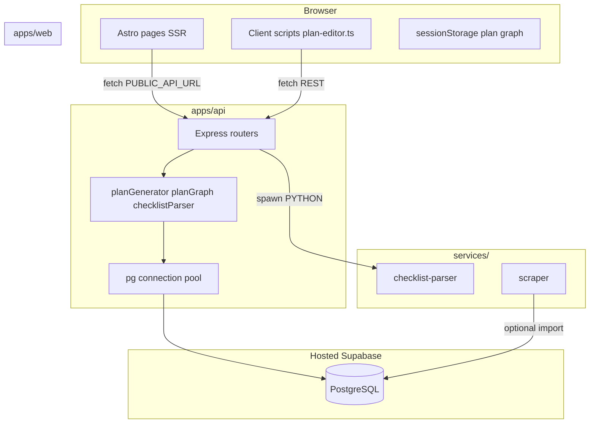

# Architecture

YorkLanes is an **npm workspaces monorepo** with a browser UI, a Node API, Python sidecars, and a hosted Supabase Postgres database.

## System diagram



## Design principles

1. **Schema in migrations** — `supabase/migrations/` is the source of truth. The API uses raw SQL via `pg`, not an ORM.
2. **API owns writes** — Feature logic that touches multiple tables (plan import, layout moves) lives in `apps/api/src/services/`.
3. **SSR for plan pages** — `/plan` is server-rendered (`prerender = false`) so `?id=` resolves on each request.
4. **Client interactivity where needed** — Drag-and-drop, SVG dependency lines, and completion toggles run in `apps/web/src/scripts/`.
5. **Shared plan graph for future features** — `apps/web/src/lib/plan-store.ts` caches placements and prerequisite edges in `sessionStorage` so schedule/progress features can read the active plan without re-fetching.

## Apps

### `apps/web` (Astro + Tailwind)

| Concern | Location |
|---------|----------|
| Pages | `src/pages/` — file-based routing |
| Layouts | `src/layouts/DashboardLayout.astro`, `BaseLayout.astro` |
| API client helpers | `src/lib/plans.ts`, `src/lib/api.ts` |
| Types shared with UI | `src/types/` |
| Interactive UI | `src/scripts/plan-editor.ts`, `plan-setup.ts` |
| Styles | `src/styles/global.css` (includes `.plan-*` editor classes) |

Astro runs on port **4321**. Feature pages call the Express API using `PUBLIC_API_URL` from `.env.local`.

### `apps/api` (Express + TypeScript)

| Concern | Location |
|---------|----------|
| Entry | `src/index.ts` — mounts routers, CORS, JSON body |
| Routes | `src/routes/*.ts` — thin HTTP layer |
| Business logic | `src/services/*.ts` |
| DB pool | `src/db/index.ts`, `resolveDatabaseUrl.ts` |
| Static reference data | `src/data/faculty-checklists.ts` |

API runs on port **3001**. Database URL resolution prefers `SUPABASE_DB_URL`, then `DATABASE_URL`.

### `services/checklist-parser` (Python)

Invoked as a subprocess by `checklistParser.ts`. Reads a temp PDF/DOCX path, prints JSON to stdout. No HTTP server.

### `services/scraper` (Python)

Standalone CLI for populating `courses` and `course_prerequisites`. Used by the course explorer feature (in progress).

## Request flows

### Degree plan import

```
User uploads PDF/DOCX on /plan/setup
  → POST /api/plans/import (multipart)
  → parseChecklistFile() spawns parse_checklist.py
  → inferChecklistMetadata() fills faculty / start year
  → createPlanFromChecklist() INSERT degree_plans, plan_terms, plan_courses
  → 201 { plan, parsed, inferred }
  → Browser stores plan id in sessionStorage, navigates to /plan?id=...
```

### Plan page load

```
GET /plan?id=<uuid>  (Astro SSR)
  → fetchPlan(planId) → GET /api/plans/:id
  → getPlanById() SELECT plan + terms + courses
  → HTML rendered with embedded JSON in #plan-data
  → Client initPlanEditor() → GET /api/plans/:id/graph
  → buildPlanGraph() joins course_prerequisites + course descriptions
  → SVG lines drawn on course selection
```

### Prerequisite satisfaction

Edges come from:

- **Prerequisites** — `course_prerequisites` table (populated by scraper)
- **Co-requisites** — parsed from `courses.description` text (“Co-requisite(s): …”)

An edge is **satisfied** when the source course is in an earlier term, marked **completed**, or (for co-reqs) the paired course is completed.

## Authentication (not wired yet)

Tables include `users` and RLS policies, but routes do not enforce auth. `degree_plans.user_id` is nullable. When OAuth lands:

1. Implement `apps/api/src/middleware/auth.ts`
2. Attach `user_id` on plan create
3. Tighten RLS policies from permissive `using (true)` to user-scoped rules

## Extension points

Look for `EXPAND HERE` comments in:

- `apps/api/src/index.ts` — mount new routers
- `apps/web/src/layouts/DashboardLayout.astro` — sidebar nav
- `supabase/migrations/` — new tables per feature

See [Development guide](./development.md) for the step-by-step feature checklist.
