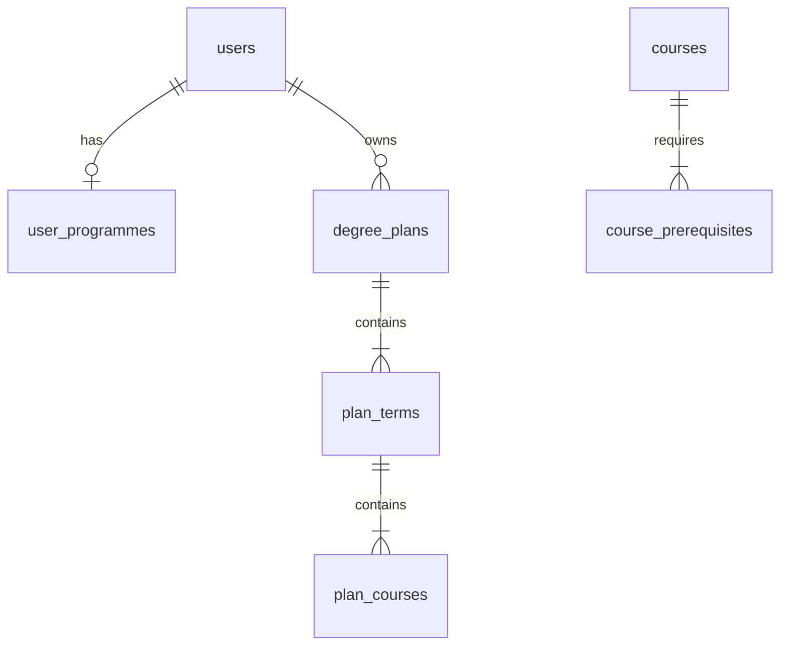

# Database

PostgreSQL hosted on **Supabase** (`edrbocogcqmqalexgajq`). Schema is versioned in `supabase/migrations/`.

## Connection paths

| Consumer | Env variable | Library |
|----------|--------------|---------|
| Express API | `SUPABASE_DB_URL` (preferred) or `DATABASE_URL` | `pg` pool in `apps/api/src/db/index.ts` |
| Astro (optional) | `SUPABASE_URL` + `SUPABASE_KEY` in `.env.local` | `@supabase/supabase-js` |
| Python scraper | `SUPABASE_DB_URL` or `DATABASE_URL` | `psycopg2` / similar in scraper |

The API uses **direct SQL** with a session pooler URI. The web app’s Supabase JS client is used for the todos connection test page; feature pages primarily talk to Express.

## Entity relationship (simplified)



## Tables

### Core (foundation)

| Table | Purpose |
|-------|---------|
| `users` | Google OAuth profile (not wired to UI yet) |
| `user_programmes` | Onboarding programme + start year |
| `courses` | Course catalogue (code, title, description, credits) |
| `course_prerequisites` | Prerequisite codes per course (`course_id`, `prerequisite_code`) |
| `todos` | Supabase quickstart / connection test |

### Degree plan editor

| Table | Purpose |
|-------|---------|
| `degree_plans` | One imported checklist plan (faculty, programme, warnings JSON) |
| `plan_terms` | Fall/Winter columns per checklist year |
| `plan_courses` | Course or stub row in a term |

#### `plan_courses` columns (after all migrations)

| Column | Type | Notes |
|--------|------|-------|
| `id` | uuid | Primary key |
| `term_id` | uuid | FK → `plan_terms` |
| `course_code` | text | e.g. `EECS 1012` or stub label |
| `credits` | numeric | Nullable |
| `title` | text | Display subtitle or stub options summary |
| `checklist_year` | int | 1–4 from checklist |
| `sort_order` | int | Order within term |
| `entry_kind` | text | `course` or `stub` |
| `section_label` | text | Complementary / elective section name |
| `completed` | boolean | User-marked completion (default false) |

The API detects whether `completed` exists at runtime (`planCourseSchema.ts`) for backwards compatibility if a remote DB lags migrations.

## Migration history

| File | Purpose |
|------|---------|
| `20250619000001_todos_quickstart.sql` | `todos` table |
| `20250619000002_yorklanes_core_schema.sql` | `users`, `courses`, `course_prerequisites`, … |
| `20250619000003_yorklanes_rls.sql` | Row Level Security policies |
| `20250619190000_degree_plans.sql` | `degree_plans`, `plan_terms`, `plan_courses` |
| `20250619200000_fix_degree_plans_rls.sql` | Permissive policies for dev (no auth yet) |
| `20250619210000_plan_course_stubs.sql` | `entry_kind`, `section_label` |
| `20250619220000_plan_course_completed.sql` | `completed` column (original) |
| `20250619230000_add_plan_course_completed.sql` | Re-add `completed` if drift on remote |

## Row Level Security

RLS is **enabled** on plan tables. Current policies allow all operations (`using (true)`) because there is no authenticated user session yet. Before production with real users:

1. Scope `degree_plans` to `auth.uid()` or API-set `user_id`
2. Replace open policies with `user_id = current_setting('app.user_id')::uuid` or Supabase Auth helpers

## Workflow

```bash
# Create migration
# supabase/migrations/20250621120000_my_change.sql

# Push to hosted project (linked)
npm run supabase:push

# Verify
npx supabase migration list
```

If `migration list` shows a version as applied but the column is missing (schema drift), add a **new** migration with `ADD COLUMN IF NOT EXISTS` — do not delete rows from `supabase_migrations.schema_migrations` unless you know what you are doing.

## Seed data

`supabase/seed.sql` runs on `npm run supabase:reset` (local only). Hosted dev relies on scraper imports and manual checklist uploads.

## Related

- [`supabase/README.md`](../supabase/README.md) — CLI commands
- [Development guide](./development.md) — env setup
- [Degree plan](./features/degree-plan.md) — how plan rows are created
